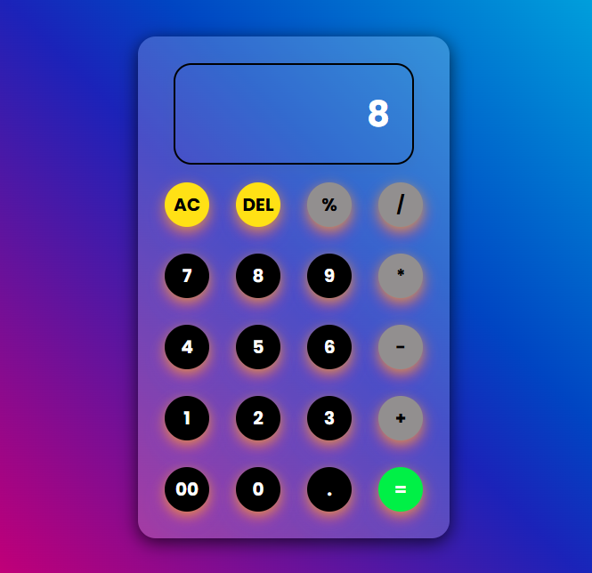
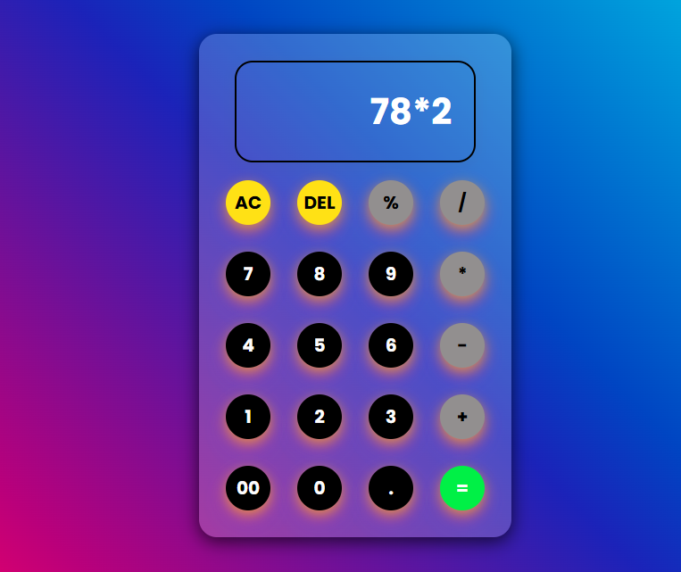

Hello All !! , This is a Basic Calculator that is built using HTML , CSS , Javascript which performs basic mathematical operations like addition , substraction , Multiplication , Division , Modules . The below is the preview of the webpage :  
  
  
Thank you for visiting this repository , please feel free to give feedback on this repo to my email id.